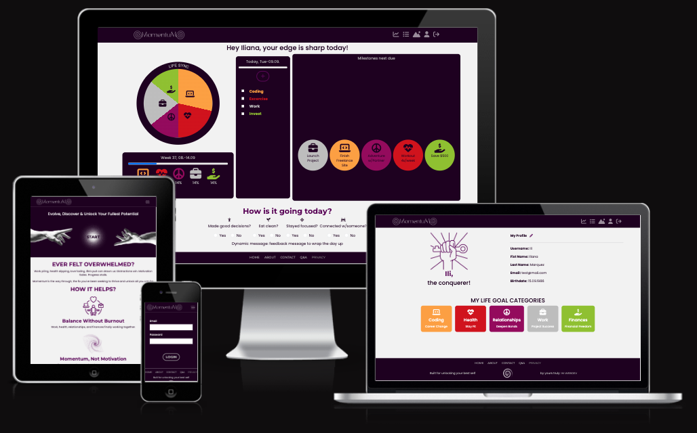
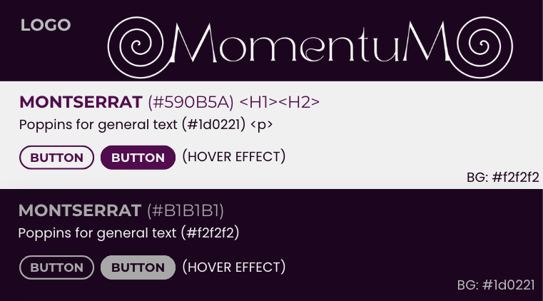
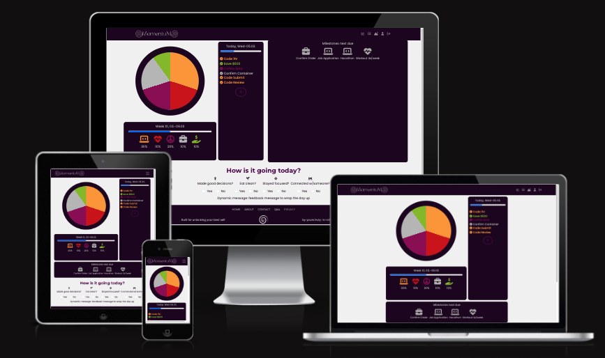
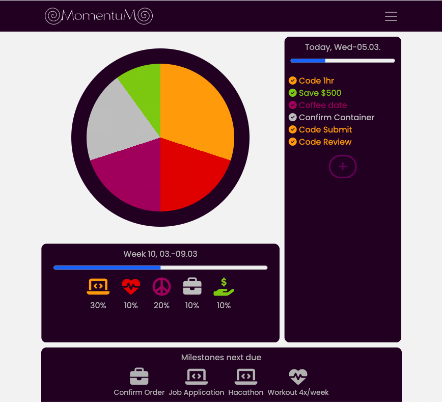
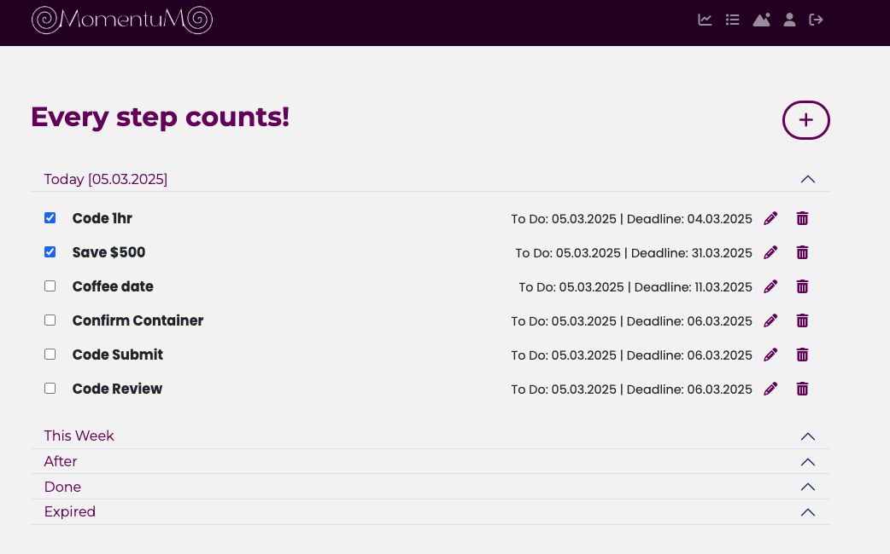

# Momentum 

Momentum is a life-tracking web app that helps you stay present while building your future. It prevents overwhelm by syncing your life areas into one clear dashboard, where task management, progress bars, and the Life Sync Chart make balance visual and intuitive — guiding steady, meaningful progress toward your full potential.

**[Live Project](https://iliana-marquez.github.io/momentum/)**

---

## User Experience (UX)

### User Stories
- **As a user,** I want to add tasks easily, so I can track my goals without hassle.
- **As a user,** I want a chart to see how my life balances, so I can adjust my focus.
- **As a user,** I want progress bars for today and the week, so I feel present and motivated.
- **As a user,** I want a simple login, so I can jump into my day fast.
- **As a user,** I want tasks sorted by Today, Week, After, Done, Expired, so I stay organized.

#### Original Ideas (Time Ran Out)
- Daily checkup—intuitive questions to reflect on life goals.
- Edit/delete tasks—full CRUD control.
- Dynamic register—new users join.
- Milestones/profile—track big wins, personalize.

### Design

- **Responsive:** Mobile/tablet-first—larger screens need polish.

---
## Features

- **Login:** Quick access—“iliana.marquez@mail.com” / “MyPassord123”—starts your flow.
- **Dashboard:** Life Sync Chart (category %) visualizes balance—Today/Week Progress Bars track presence.
- **Tasks:** Add tasks via modal—sorts into Today, Week, After, Done, Expired—keeps you grounded.
- **Future:** Edit/delete, milestones, daily checkup—growth tools (time cut short).

---

## Technologies Used

- HTML, CSS, JavaScript—core build.
- Bootstrap—responsive layout, modal.
- Font Awesome—icons (e.g., plus, trash).

---

## Testing

- **User Flow:** Login with “iliana.marquez@mail.com” / “MyPassword123”—only Dashboard link—tasks syncs live.
- **Features:** Add task—list updates—Chart recalculates %—Progress bars show today/week—responsive on mobile/tablet.
- **Fixed Bugs:** Consistent live calculations—percentages sync across Dashboard sections.
- **Validation:** Pending—HTML/CSS checks in progress (time crunch).

### Known Bugs
1. Dashboard boxes wrap oddly on very large screens—needs aesthetic fix.
2. Delete/update tasks—missing—CRUD incomplete.
3. Static register, milestones, profile—hardcoded, not dynamic—daily checkup placeholder only.
4. Responsiveness—larger devices lag—mobile/tablet-first design.

### Further Improvements
- Add delete/update—full task control.
- Dynamic register—new users join.
- Milestones/profile—track big goals, personalize.
- Daily checkup—intuitive questions for focus.
- Polish large-screen layout—full responsiveness.

---

## Deployment

Deployed via GitHub Pages:
1. Pushed to `iliana-marquez/momentum` repo.
2. Enabled Pages in settings—main branch.
3. Live at `https://iliana-marquez.github.io/momentum/`.

---

## Credits

- **Bootstrap:** Wireframes, images and icons.
- **Canva:** Layout, modal framework.
- **Font Awesome:** Icons.
- **Code Institute:** README inspiration.

---
