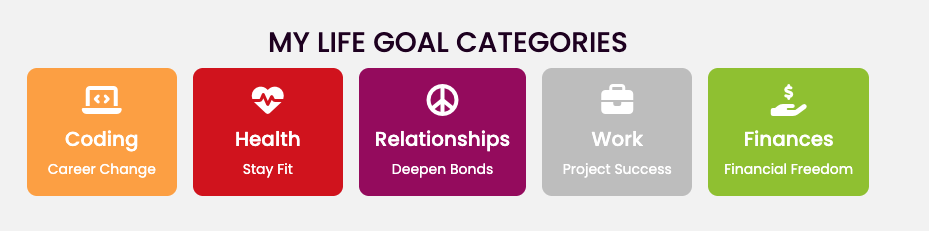

# Momentum 

Momentum is a life-tracking web app that helps you stay present while building your future. It prevents overwhelm by syncing your life areas into one clear dashboard, where task management, progress bars, and the Life Sync Chart make balance visual and intuitive — guiding steady, meaningful progress toward your full potential.


**[Try it out!](https://iliana-marquez.github.io/momentum/)**

---
## Table of Contents

- [User Experience (UX)](#user-experience-ux)
  - [User Stories](#user-stories)
  - [Design](#design)
- [Features](#features)
  - [Existing Features](#existing-features)
  - [Features Left to Implement](#features-left-to-implement)
- [Technologies Used](#technologies-used)
  - [Languages](#languages)
  - [Frameworks, Libraries & Tools](#frameworks-libraries--tools)
- [Testing](#testing)
  - [Instructions](#instructions)
  - [Testing User Stories from User Experience (UX) Section](#testing-user-stories-from-user-experience-ux-section)
  - [Feature Testing](#feature-testing)
  - [Browser and Device Testing](#browser-and-device-testing)
  - [Accessibility Testing](#accessibility-testing)
  - [Performance Testing](#performance-testing)
  - [Known Bugs](#known-bugs)
- [Deployment](#deployment)
  - [GitHub Pages](#github-pages)
  - [Forking the GitHub Repository](#forking-the-github-repository)
  - [Making a Local Clone](#making-a-local-clone)
  - [Local Development Setup](#local-development-setup)

---
## User Experience (UX)

### Current User Story Goals

As User, I want:
- To easily understand the main purpose of the site and learn how it can help me balance different areas of my life.
- To quickly log in and see my current progress across all life areas through the dashboard's Life Sync pie chart and progress bars.
- To add, edit, complete or delete tasks efficiently while seeing immediate visual feedback through dynamic modals.
- To add, edit, complete or delete milestones efficiently while seeing immediate visual feedback.
- To see my tasks automatically categorized (Today, This Week, Overdue, Done, Expired) and my milestones organized by life goal categories.
- To see real-time updates to the Life Sync chart and progress percentages as I complete tasks.
- To visualize my next due milestones prominently on the dashboard so I stay focused on important deadlines and prevent "out of sight, out of mind" forgetting.
- My data to persist during my browser session so I don't lose updates while navigating between pages.

### Design

#### Colour Scheme
- The primary colors are dark purple (#1d0221) and light grey (#f2f2f2) creating a calmed, focused atmosphere
- Accent colors include highlight purple (#590b5a) and light highlight (#b1b1b1)


- Category-specific colors: Coding (#f89e37), Health (#cb0e16), Relationships (#900c5e), Work (#bdbdbd), Finances (#92bf1c)


#### Typography
- Montserrat is used for headings, providing a clean, professional look
- Poppins is used for content text, ensuring excellent readability
- Both fonts include fallbacks to ensure cross-platform compatibility

#### Wireframes
Created using Canva during the design planning phase (desktop and mobile versions):
- Landing Page Wireframe - With Hero, About, Contact and Q&A sections
- Login Page Wireframe - Form to log in
- Dashboard Page Wireframe - Focused on pie chart visualization and progress tracking
- Tasks Page Wireframe - Emphasizing CRUD operations and categorization
- Milestones Page Wireframe - Emphasizing CRUD operations and categorization
- Profile Page Wireframe - Emphasizing on User Profile Info display

#### Imagery
- Clean, minimalist design with images form Canva and category-specific icons from FontAwesome
- Visual progress charts including a "Life Sync" pie chart showing category balance
- Consistent color-coding throughout the interface for immediate category recognition

---
## Features

### Existing Features

- **Authentication System:** Login/logout with session persistence
- **Dashboard - Life Sync Chart:** Interactive pie chart automatically syncing with all tasks to show overall balance across 5 life categories
- **Dashboard- Progress Visualization:** Today and weekly progress bars with percentage tracking
- **Dashboard - Week Category Balance:** Real-time percentage distribution showing completed vs incomplete tasks for each category during the current week
- **Dashboard- Next Due Milestones:** Visual section showing upcoming milestone deadlines to maintain focus and prevent oversight
- **Dashboard - Balance Monitoring:** Analytics enabling users to identify when one life area gains disproportionate weight while others diminish
- **Task and Milestone Management:** Complete CRUD operations (Create, Read, Update, Delete) for tasks
- **Milestone Tracking:** Full milestone management with due date tracking
- **Data Persistence:** All user data saved to localStorage for session continuity
- **Responsive Design:** Mobile-first approach working across all device sizes
- **Profile Management:** Username information editing, profile information and life category display
- **Smart Categorization:** Automatic task sorting into Today, This Week, Overdue, Done, Expired - **Interactive Feedback:** Dynamic modals for user actions with immediate confirmation

### Features Left to Implement

- Daily check-up questionnaire for reflection and motivation
- Advanced analytics and progress history tracking
- Social features for sharing progress with accountability partners
- Integration with external calendars, management tools and fitness trackers
- AI-powered goal recommendations and coaching insights
- True cross-session data persistence ("build momentum over time")
- Historical progress tracking showing improvement patterns over weeks/months
- User profile customization and personalized life goal categories

---

## Technologies Used

### Languages:
- HTML, CSS, JavaScript

### Frameworks, Libraries & Tools:
- Bootstrap: responsive layout, modal components, and form styling.
- Font Awesome: icons for life categories, navigation, and user interface elements
- Google Font: typography.
- Canva: design, wireframes, images, icons.
- Github: version control.
- VSCode: code editing.

---
## Testing

### Instructions:

Use these credentials for testing 
> email: test@mail.com <br>
> password: test

### Testing User Stories from User Experience (UX) Section

1. **Understanding the main purpose and life balance concept**
- Upon entering the site, users see clear landing page explaining "Sync your life effortlessly with Momentum"
- About section details how it helps achieve balance without burnout across 5 life categories
- Hero section and Q&A provide immediate context about the application's value proposition
- The prominent "START" button on the homepage leads directly to login page

2. **Quick login and dashboard progress visualization**
- Login with *email: test@mail.com / password: test* credentials provides immediate access
- Dashboard immediately displays Life Sync pie chart showing category distribution
- Progress bars show today and weekly completion percentages
- Week category balance section displays real-time percentage distribution
- Next due milestones display 

3. **Efficient task CRUD operations with immediate feedback**
- Tasks can be added via prominent "+" buttons on dashboard and tasks page
- Edit functionality on task management page, accessible through pencil icons with comprehensive modal forms
- Delete operations protected by confirmation modals preventing accidental removal 
- Task completion toggles via checkboxes with immediate visual feedback and chart updates

4. **Efficient milestone CRUD operations with immediate feedback**
- Milestones can be added through dedicated modal forms with category selection
- Edit functionality available through pencil icons with full property modification
- Delete operations use confirmation modals for safe removal
- Completion status toggles with immediate dashboard updates

5. **Automatic categorization and organization**
- Tasks automatically sort into Today, This Week, Overdue, Done, Expired sections
- Milestones organize by life goal categories in accordion-style interface
- Dashboard displays properly categorized data with accurate counts

6. **Real-time Life Sync chart and progress updates**
- Pie chart recalculates percentages immediately when tasks are added, completed, or deleted
- Progress bars update in real-time showing today and weekly completion rates
- Week category balance section reflects current week percentage distribution across all categories

7. **Next due milestones visualization**
- Dashboard prominently displays up to 5 upcoming milestones in "Milestones next due" section
- Milestones displayed with category-specific colors and icons for immediate recognition
- Sorted by due date to prioritize most urgent deadlines

8. Session data persistence
- All task and milestone changes persist when navigating between pages
- Login state maintains across browser navigation
- User modifications remain available throughout the session

### Feature Testing

#### Authentication System
- **Login**: Successfully authenticates with test@mail.com / test credentials
- **Session Persistence**: Login state maintained across browser refresh and navigation
- **Logout**: Properly clears all data and redirects to homepage
- **Page Protection**: Protected pages redirect to login when accessed without authentication

#### Task and Milestone Management (CRUD Operations)
- **Create:** Tasks and milestones can be added with validation and immediate dashboard integration
- **Read:** Items display correctly in categorized sections with proper filtering and organization
- **Update:** Edit modals allow modification of all properties with immediate saving and chart updates
- **Delete:** Confirmation modals prevent accidental deletion, properly remove from localStorage and update displays
- **Completion Toggle:** Status changes provide immediate visual feedback with real-time chart recalculation

#### Dashboard Features
- **Life Sync Chart**: Pie chart accurately reflects task distribution across all 5 categories with real-time updates
- **Progress Bars**: Today and weekly progress bars show correct completion percentages
- **Weekly Display**: Accurately calculates and displays distribution % of tasks per category with Monday-Sunday range
- **Next Due Milestones:** Displays up to 5 upcoming milestones sorted by due date with category indicators
- **Balance Monitoring:** Visual indicators help identify category imbalances for proactive rebalancing

#### Smart Categorization and Interactive Feedback
- **Automatic Sorting:** Tasks properly categorize based on dates and completion status, while milestones categorize basend on life goal categories.
- **Dynamic Modals:** All user actions provide immediate confirmation through feedback modals
- **Real-time Updates:** All interactions immediately reflect in dashboard calculations and displays

#### Profile Management 
- **User Information Display:** Profile shows username, personal details, and life category information
- **Username Editing:** Profile edit modal allows username modification with immediate dashboard reflection
- **Life Category Display:** Visual cards show all 5 categories with colors, icons, and focus areas

#### Data Persistence and Navigation
- **localStorage Integration:** All changes persist across page navigation within browser session
- **Cross-Page Consistency:** Task and milestone data remains synchronized across dashboard, tasks, and milestones pages
- **Session Continuity:** User modifications available throughout entire browser session

### Bug Discovery and Resolution Testing

#### Event Listener Duplication Bug (Critical Fix)
- **Issue Discovered**: Adding multiple tasks in sequence caused exponential function calls (updateTaskList function called thousands of times)
- **Test Case**: Add tasks quickly and monitor browser performance/console
- **Resolution Verified**: Event listeners now properly managed during initialization
- **Result**: Application remains responsive under heavy task creation

#### Task Categorization Gap (Data Integrity Fix)
- **Issue Discovered**: Tasks with past-due dates but unreached deadlines became invisible "ghost" tasks
- **Test Case**: Create task with yesterday's date but future deadline, verify task appears in UI
- **Resolution Verified**: Added "Overdue" category captures these edge cases
- **Result**: All tasks remain visible and manageable regardless of date combinations

#### Pie Chart Icon Management (UX Enhancement)
- **Issue Discovered**: Icons displayed for empty categories, creating visual clutter
- **Test Case**: Start with fresh data (no tasks), verify only relevant category icons show
- **Resolution Verified**: Smart icon visibility with chart-icon-hidden class implementation
- **Result**: Clean, focused dashboard visualization

#### Week Calculation Edge Case (Date Logic Fix)
- **Issue Discovered**: Sunday week calculations showed incorrect current week
- **Test Case**: Test application on Sunday, verify current week range displays correctly
- **Resolution Verified**: Fixed getCurrentWeekRange() for proper Monday-Sunday handling
- **Result**: Accurate weekly progress tracking regardless of day of week

### Browser and Device Testing
- **Browsers Tested**: Chrome, Firefox, Safari, Edge
- **Devices Tested**: Desktop (1920x1080), Tablet (768px), Mobile (320px-480px)
- **Responsive Behavior**: Layout adapts correctly across all screen sizes with mobile-first approach
- **Touch Interactions**: All buttons and interactive elements work properly on touch devices

### Accessibility Testing
- **Keyboard Navigation**: All interactive elements accessible via keyboard
- **Screen Reader Compatibility**: Semantic HTML structure with appropriate ARIA labels
- **Color Contrast**: All text meets WCAG contrast requirements
- **Focus Indicators**: Clear focus outlines on all interactive elements

### Performance Testing
- **Load Times**: All pages load quickly with optimized assets
- **JavaScript Performance**: No memory leaks or performance issues during extended use
- **Data Operations**: CRUD operations execute efficiently with immediate user feedback
- **localStorage Usage**: Efficient data storage without browser limitations

### Known Bugs
- **Large Screen Layout**: Dashboard milestone box may wraps oddly on very large screens - aesthetic issue that doesn't affect functionality

---

## Deployment

### GitHub Pages

The project was deployed to GitHub Pages using the following steps:

1. Log in to GitHub and locate the [Momentum Repository](https://github.com/iliana-marquez/momentum)
2. At the top of the Repository, locate the "Settings" Button on the menu
3. Scroll down the Settings page until you locate the "Pages" Section
4. Under "Source", click the dropdown called "None" and select "Deploy from a branch"
5. Select "main" branch and "/ (root)" folder
6. Click "Save" and the page will automatically refresh
7. Scroll back down through the page to locate the now published site [link](https://iliana-marquez.github.io/momentum/) in the "Pages" section

### Forking the GitHub Repository

By forking the GitHub Repository you make a copy of the original repository to view and/or make changes without affecting the original repository:

1. Log in to GitHub and locate the [Momentum Repository](https://github.com/iliana-marquez/momentum)
2. At the top of the Repository just above the "Settings" Button on the menu, locate the "Fork" Button
3. Click the fork button and select your account as the destination
4. You should now have a copy of the original repository in your GitHub account

### Making a Local Clone

1. Log in to GitHub and locate the [Momentum Repository](https://github.com/iliana-marquez/momentum)
2. Under the repository name, click "Code"
3. To clone the repository using HTTPS, under "Clone with HTTPS", copy the link
4. Open Git Bash
5. Change the current working directory to the location where you want the cloned directory
6. Type `git clone`, and then paste the URL you copied in Step 3

```bash
$ git clone https://github.com/iliana-marquez/momentum.git
```

7. Press Enter. Your local clone will be created
8. Open index.html in your browser to run the application locally

### Local Development Setup

1. Clone the repository as described above
2. Open the project folder in your preferred code editor
3. Use a local server (such as Live Server extension in VS Code) to run the application
4. No additional build process or dependencies required - the app runs entirely in the browser

---

## Credits

- **Bootstrap:** Wireframes, images and icons.
- **Canva:** Layout, modal framework.
- **Font Awesome:** Icons.
- **Code Institute:** README inspiration.

---
